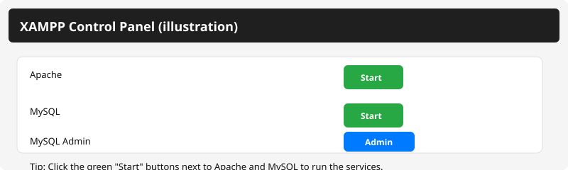

# Inventory Management System

A comprehensive web-based inventory management application built with **Laravel 11** and **Blade templating**. This system is designed to help restaurants and cafes efficiently manage their menu items, ingredients, inventory levels, and orders.

## Features

### Dashboard
- **Overview Dashboard**: Get a quick snapshot of your business metrics
- **Sales Summary**: View total sales and revenue trends
- **Top Selling Items**: Identify your most popular menu items
- **Real-time Monitoring**: Track key business indicators at a glance

### Menu Item Management
- **Create & Edit Menu Items**: Add new dishes with descriptions and pricing
- **Item Details**: View comprehensive information about each menu item
- **Ingredient Tracking**: Manage ingredients required for each menu item
- **Image Support**: Upload and display menu item photos
- **Status Tracking**: Monitor inventory levels for each item

### Inventory Management
- **Low Stock Alerts**: Get notified when items fall below minimum thresholds
- **Ingredient Management**: Track all ingredients and their quantities
- **Ingredient Groups**: Organize ingredients into categories
- **Restocking**: Easy restock functionality to update ingredient quantities
- **Stock Levels**: Monitor current and historical ingredient levels

### Order Management
- **Create Orders**: Place new orders with selected menu items
- **Order Details**: View complete order information and history
- **Order Items**: Track individual items within each order
- **Order History**: Access past orders for reference and analysis
- **Status Tracking**: Monitor order fulfillment status

### User Interface
- **Responsive Design**: Works seamlessly on desktop and mobile devices
- **Intuitive Navigation**: Clean sidebar for easy access to all features
- **Professional Styling**: Modern CSS styling for a polished look
- **Data Visualization**: Charts and summaries for quick insights

## Tech Stack

- **Framework**: Laravel 11
- **Database**: MySQL/SQLite
- **Frontend**: Blade Templates, HTML5, CSS3
- **Build Tool**: Vite
- **PHP Version**: 8.2+

## Installation

### Prerequisites
- PHP 8.2 or higher
- Composer
- Node.js & npm
- MySQL or SQLite

### Setup Steps

1. **Clone the repository**
   ```bash
   git clone https://github.com/Typhoic/InventoryManagement-Project.git
   cd InventoryManagement-Project
   ```

2. **Install PHP dependencies**
   ```bash
   composer install
   ```

3. **Install JavaScript dependencies**
   ```bash
   npm install
   ```

4. **Create environment file**
   ```bash
   cp .env.example .env
   ```

5. **Generate application key**
   ```bash
   php artisan key:generate
   ```

6. **Run database migrations**
   ```bash
   php artisan migrate
   ```

7. **Seed the database (optional)**
   ```bash
   php artisan db:seed
   ```

8. **Build frontend assets**
   ```bash
   npm run build
   ```

9. **Start the development server**

   Option A - Artisan dev server (recommended for development):
   ```bash
   php artisan serve --host=127.0.0.1 --port=8000
   ```
   Open in browser: http://127.0.0.1:8000

   Option B - Using XAMPP (Apache + MySQL):
   - Open the XAMPP Control Panel and click the **Start** button next to **Apache** and **MySQL** (buttons will turn green when running).

   
   *Click the green **Start** buttons next to Apache and MySQL to run services.*

   - (Optional) Click the **Admin** button next to MySQL to open phpMyAdmin.
   - Configure an Apache VirtualHost pointing to the project's `public` folder (or place the project in XAMPP's `htdocs`).
   - Restart Apache and open http://localhost/your-path (or your configured host).

**Local dev credentials** (seeded by `UserSeeder`)

- Username: `admin`
- Password: `password`

For a full step-by-step guide including XAMPP button instructions, database setup, migrations, and seeding, see `LOCAL_SETUP.txt` in the project root.

## 🗂️ Project Structure

```
├── app/
│   ├── Http/
│   │   └── Controllers/
│   │       ├── DashboardController.php
│   │       ├── MenuItemController.php
│   │       ├── OrderController.php
│   │       └── IngredientController.php
│   └── Models/
│       ├── MenuItem.php
│       ├── Ingredient.php
│       ├── Order.php
│       ├── OrderItem.php
│       └── User.php
├── database/
│   ├── migrations/
│   └── seeders/
├── resources/
│   ├── views/
│   ├── css/
│   └── js/
├── routes/
│   └── web.php
└── public/
    ├── images/
    └── styles/
```

## 📊 Database Schema

### Core Tables
- **menu_items**: Store menu items with details and pricing
- **ingredients**: Track all ingredients and quantities
- **ingredient_groups**: Categorize ingredients
- **orders**: Order records with timestamps
- **order_items**: Individual items within orders
- **menu_item_ingredients**: Many-to-many relationship between menu items and ingredients

## 🚀 Usage

1. **Access Dashboard**: Land on the dashboard to see business overview
2. **Manage Menu Items**: Create, edit, or delete menu items from the Items section
3. **Track Inventory**: Monitor ingredient levels and low stock items
4. **Create Orders**: Generate new orders from the Orders section
5. **Restock Ingredients**: Update ingredient quantities when new stock arrives

## 📝 Routes

| Route | Method | Description |
|-------|--------|-------------|
| `/` | GET | Dashboard home page |
| `/items` | GET | View all menu items |
| `/items/create` | GET | Create new menu item |
| `/items/{id}/edit` | GET | Edit menu item |
| `/items/low-stock` | GET | View low stock items |
| `/orders` | GET | View all orders |
| `/orders/create` | GET | Create new order |
| `/orders/{id}` | GET | View order details |
| `/ingredients` | GET | View all ingredients |
| `/ingredient-groups` | GET | View ingredient categories |

## 🔒 Security

- Environment variables are protected via `.gitignore`
- Sensitive configuration is excluded from version control
- Laravel's built-in security features are utilized
- CSRF protection enabled on all forms

## 📄 License

This project is open source and available under the MIT License.

## 👨‍💻 Contributing

Contributions are welcome! Feel free to submit issues and pull requests.
